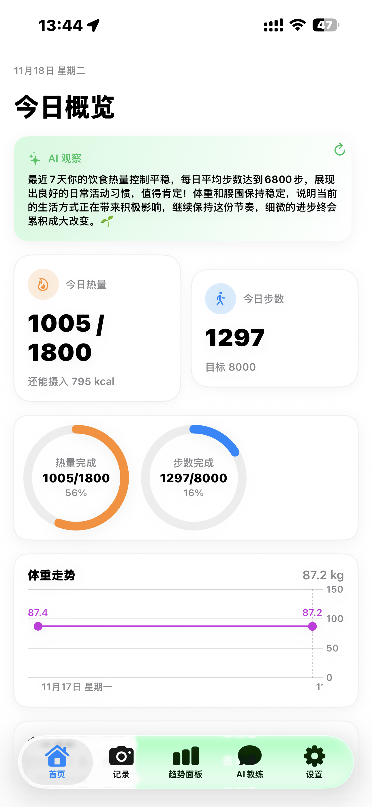
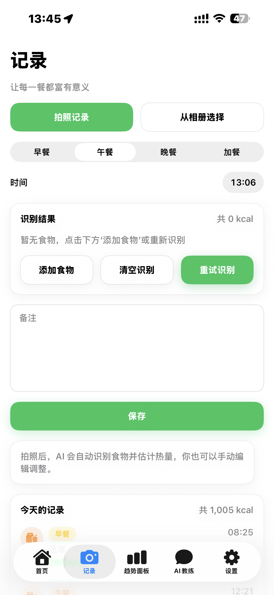
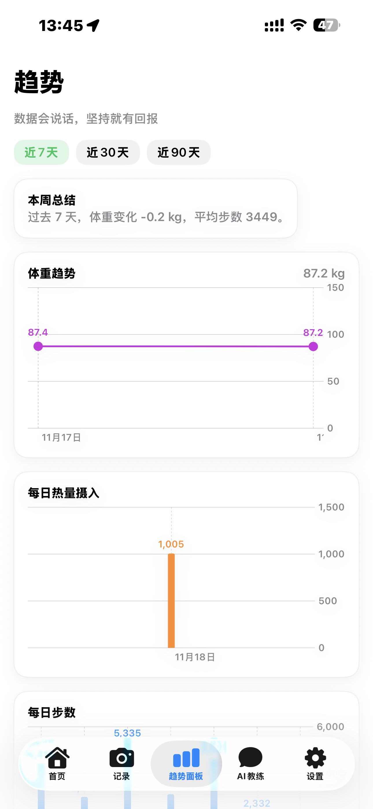
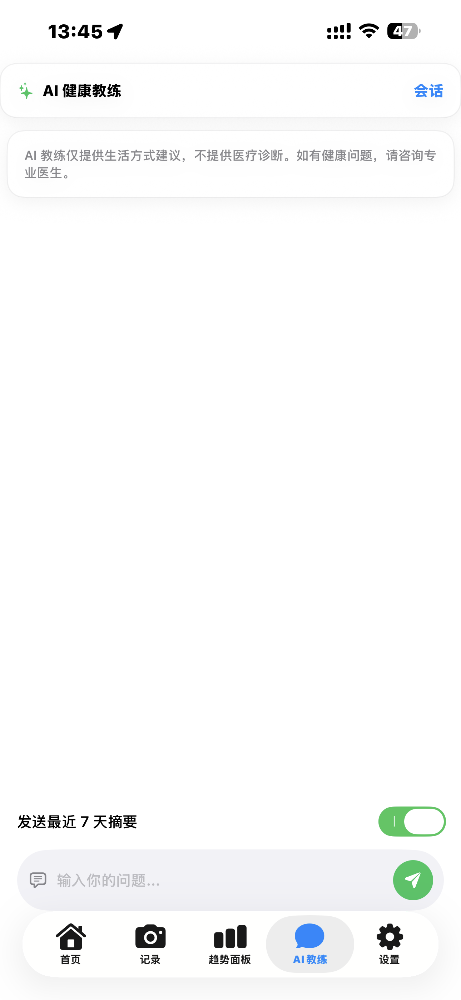
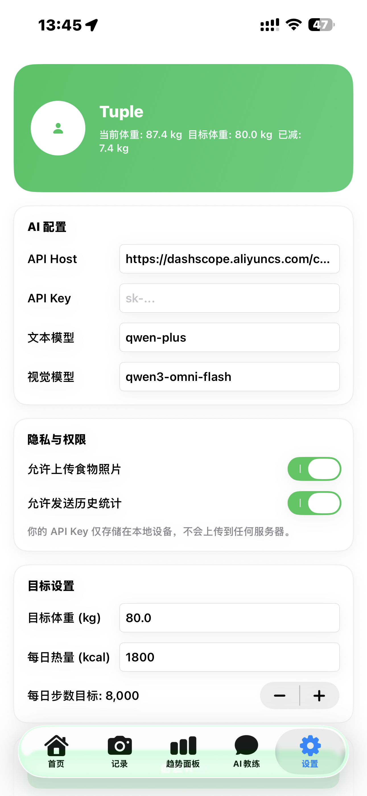

# 青柑 (Qinggan) - 健康管理应用

一个基于 SwiftUI 开发的 iOS 健康管理应用，通过 AI 技术帮助用户记录饮食、追踪体重、管理健康数据，并提供个性化的健康建议。

## 📱 功能特性

### 🍽️ 饮食记录
- **AI 食物识别**：通过拍照或从相册选择图片，AI 自动识别食物并估算热量、蛋白质、脂肪、碳水化合物等营养成分
- **手动编辑**：支持手动添加和编辑食物信息
- **餐别分类**：支持早餐、午餐、晚餐、加餐分类记录
- **历史记录**：查看近 7 天、30 天、90 天的饮食记录，支持搜索和筛选

### 📊 数据追踪
- **体重管理**：记录体重数据，查看体重趋势图表
- **步数统计**：集成 HealthKit，自动同步每日步数
- **热量追踪**：实时显示今日热量摄入和目标完成情况
- **数据可视化**：使用 Charts 框架展示体重、热量、步数等趋势图表

### 🤖 AI 健康教练
- **智能对话**：与 AI 教练聊天，获取个性化的健康建议
- **数据洞察**：AI 基于用户的饮食、体重、步数等数据提供观察和建议
- **多会话管理**：支持创建多个对话会话，管理历史对话记录
- **健康摘要**：可选择发送最近 7 天的健康数据摘要给 AI 教练

### 📈 趋势面板
- **多维度分析**：查看体重趋势、每日热量摄入、每日步数等数据
- **时间范围选择**：支持查看近 7 天、30 天、90 天的数据
- **智能总结**：AI 自动生成周期性的健康数据总结

### ⚙️ 设置管理
- **AI 配置**：自定义 AI 服务地址、模型选择、功能开关
- **目标设置**：设置每日步数目标、目标体重、每日热量目标
- **数据管理**：管理本地存储的健康数据

## 📸 应用截图

### 首页


### 饮食记录


### 趋势面板


### AI 健康教练


### 设置


## 🏗️ 技术架构

### 技术栈
- **开发语言**：Swift 5.9+
- **UI 框架**：SwiftUI
- **数据持久化**：Core Data
- **健康数据**：HealthKit
- **图表可视化**：Charts (Swift Charts)
- **架构模式**：MVVM (Model-View-ViewModel)
- **设计模式**：Repository Pattern, Protocol-Oriented Programming

### 项目结构
```
qinggan/
├── Core/                    # 核心模块
│   ├── Models/             # 领域模型
│   ├── Protocols/          # 协议定义
│   └── Utils/              # 工具类
├── Data/                    # 数据层
│   ├── Repositories/       # 数据仓库
│   ├── Services/           # 服务层（AI、HealthKit）
│   └── Notifications/      # 通知管理
├── Features/               # 功能模块
│   ├── Home/               # 首页
│   ├── Log/                # 饮食记录
│   ├── Dashboard/          # 趋势面板
│   ├── Chat/               # AI 教练
│   ├── Body/               # 体重管理
│   └── Settings/           # 设置
└── UI/                     # UI 组件
    ├── Components/         # 可复用组件
    └── SplashView.swift    # 启动页
```

### 核心组件
- **AIClient**：AI 服务客户端，支持图像识别和文本对话
- **HealthKitService**：HealthKit 集成服务，读取步数数据
- **Repository Pattern**：数据访问层，封装 Core Data 操作
- **ViewModel**：业务逻辑层，处理数据绑定和状态管理

## 🚀 快速开始

### 环境要求
- Xcode 15.0+
- iOS 16.0+
- Swift 5.9+

### 安装步骤

1. **克隆项目**
```bash
git clone <repository-url>
cd qinggan
```

2. **打开项目**
```bash
open qinggan.xcodeproj
```

3. **配置 AI 服务**
   - 在设置页面配置 AI 服务地址和 API Key
   - API Key 会安全存储在 Keychain 中

4. **配置 HealthKit**
   - 确保在 `Info.plist` 中配置了 `NSHealthShareUsageDescription`
   - 首次使用时应用会请求 HealthKit 权限

5. **运行项目**
   - 选择目标设备或模拟器
   - 按 `Cmd + R` 运行项目

## 📦 依赖项

项目使用 Swift Package Manager 管理依赖（如有）。主要系统框架依赖：
- SwiftUI
- Core Data
- HealthKit
- Charts (Swift Charts)
- UserNotifications

## 🔐 隐私与安全

- **数据存储**：所有健康数据存储在本地设备，使用 Core Data 加密存储
- **API Key 安全**：使用 Keychain 安全存储 AI 服务的 API Key
- **HealthKit 权限**：仅在用户授权后读取步数数据
- **隐私声明**：AI 教练仅提供生活方式建议，不提供医疗诊断

## 🎨 UI/UX 特性

- **现代化设计**：采用 SwiftUI 原生组件，界面简洁美观
- **深色模式支持**：自动适配系统深色模式
- **流畅动画**：使用 SwiftUI 动画系统提供流畅的用户体验
- **响应式布局**：适配不同尺寸的 iOS 设备

## 📝 使用说明

### 记录饮食
1. 打开"记录"标签页
2. 点击"拍照记录"或"从相册选择"
3. 选择餐别（早餐/午餐/晚餐/加餐）
4. 点击"识别"按钮，AI 会自动识别食物
5. 可以手动编辑识别结果或添加食物
6. 添加备注后点击"保存"

### 记录体重
1. 在首页点击"记录体重"按钮
2. 输入体重数值
3. 选择日期
4. 点击"保存"

### 使用 AI 教练
1. 打开"AI 教练"标签页
2. 输入你的健康相关问题
3. 可选择是否发送最近 7 天的健康数据摘要
4. 点击发送按钮，获取 AI 建议

### 查看趋势
1. 打开"趋势面板"标签页
2. 选择时间范围（近 7 天/30 天/90 天）
3. 查看体重、热量、步数等数据趋势图表

## 🛠️ 开发说明

### 数据模型
主要数据模型定义在 `Core/Models/DomainModels.swift`：
- `FoodItemModel`：食物项模型
- `DietRecordModel`：饮食记录模型
- `BodyRecordModel`：身体数据记录模型
- `StepStatModel`：步数统计模型
- `AIMessage`：AI 消息模型
- `AIConfig`：AI 配置模型

### 扩展功能
如需扩展功能，可以：
1. 在 `Features/` 目录下创建新的功能模块
2. 遵循 MVVM 架构模式
3. 使用 Repository 模式访问数据
4. 在 `AppRootView.swift` 中添加新的 Tab

## 📄 许可证

[在此添加许可证信息]

## 👥 贡献

欢迎提交 Issue 和 Pull Request！


---

**注意**：本应用仅提供健康生活方式建议，不提供医疗诊断。如有健康问题，请咨询专业医生。

